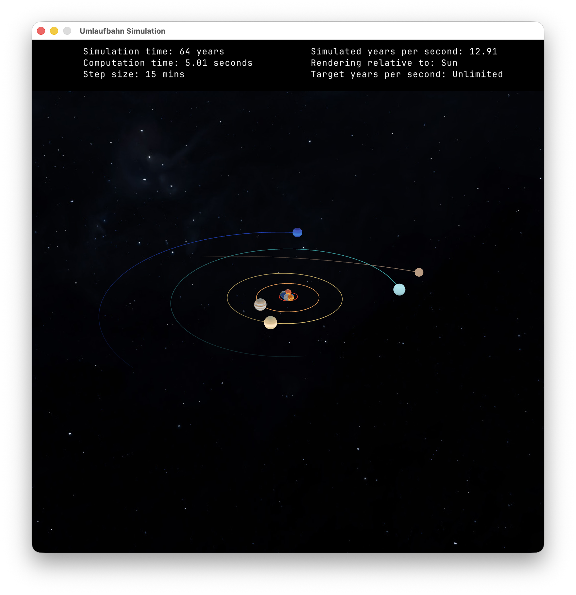
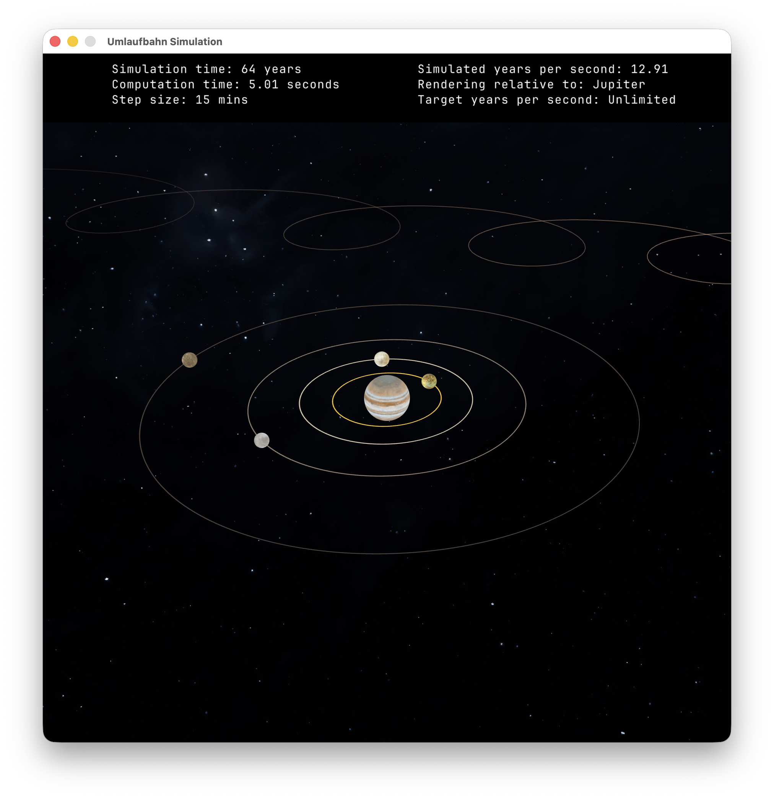
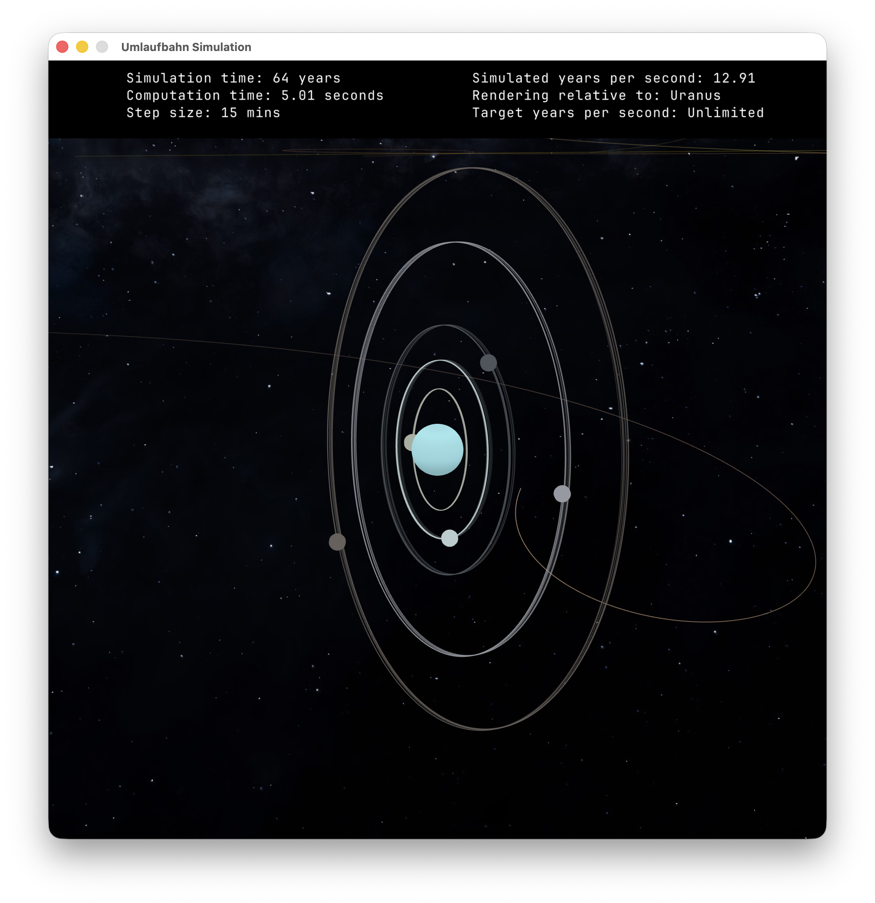
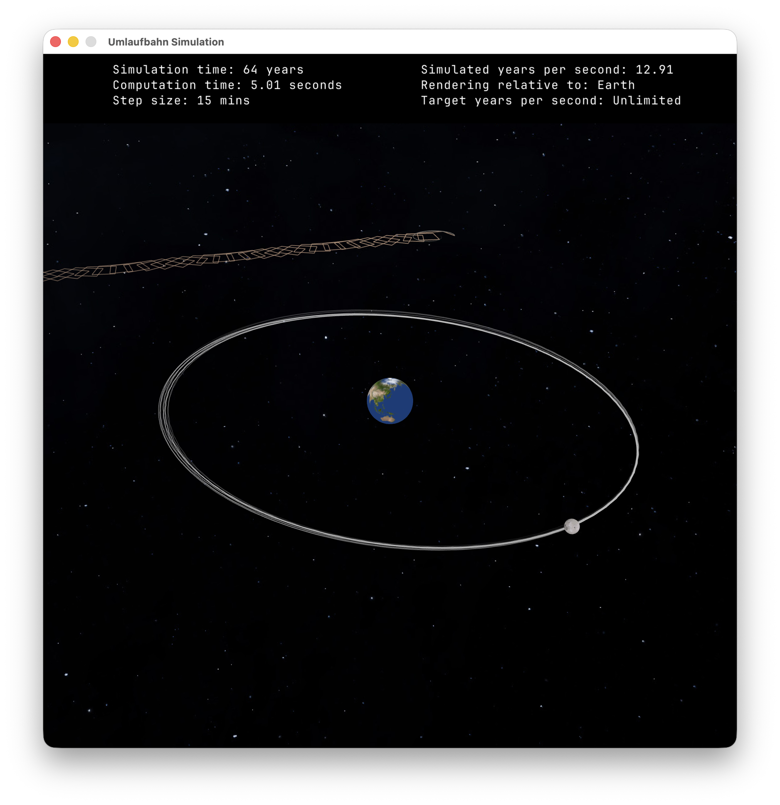
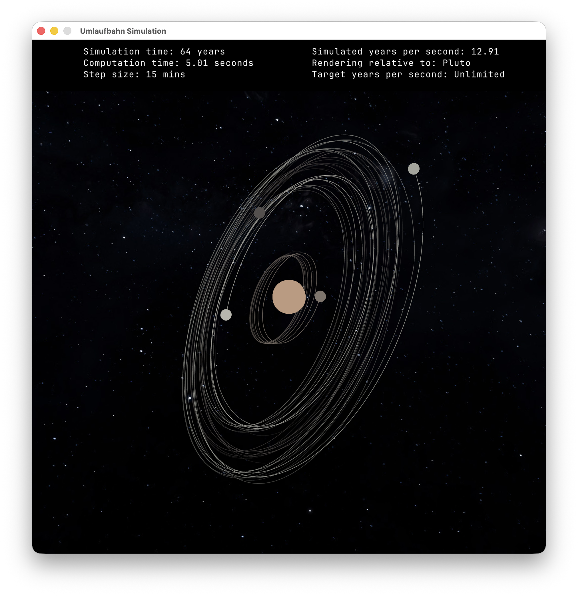
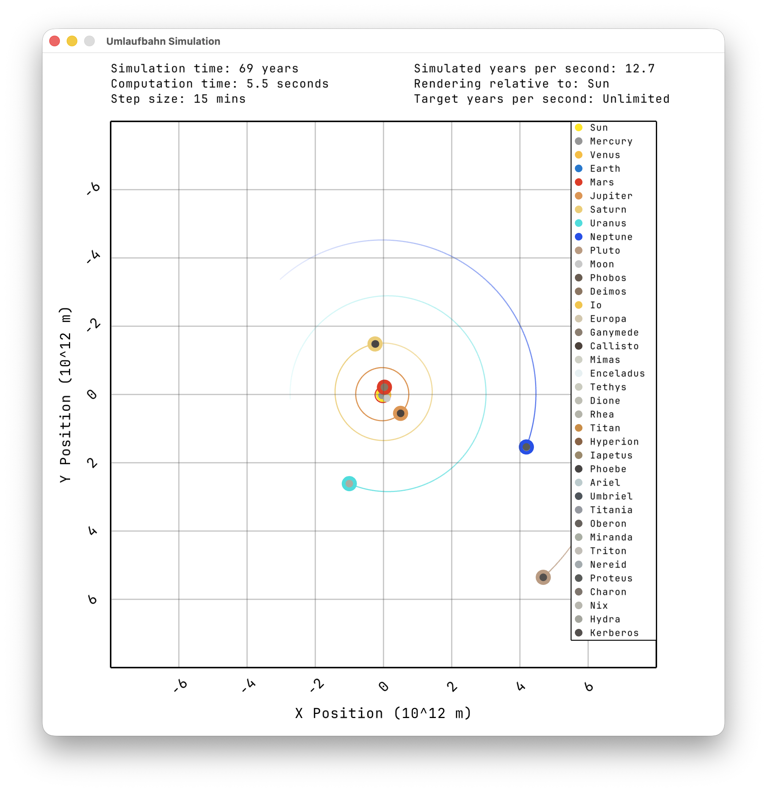
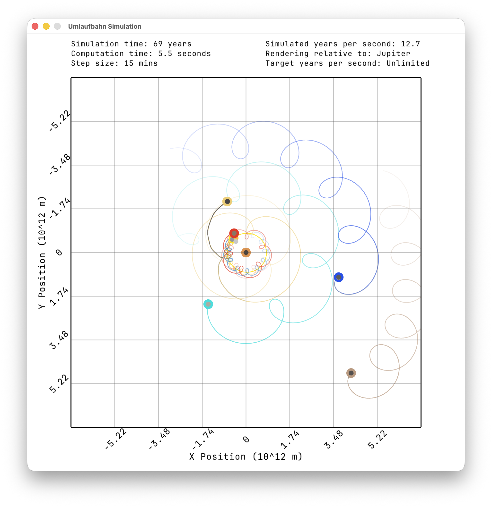

<div align="center">
  <h3 align="center">Orbit simulation</h3>

  <p align="center">
    C++20 & raylib N-body simulator, developed for a research project
    <br />
    <br />
    <a href="#1-features">Features</a> •
    <a href="#2-running-the-c-simulator">Running the C++ simulator</a> •
    <a href="#3-analysis">Analysis</a> •
    <a href="#4-research-status">Research status</a> •
    <a href="#5-attribution-and-licensing">Attribution</a>
  </p>
</div>

<div align="center">
  
  
  
  
  
  
  
</div>
<br>

> [!WARNING]
> This research software is under active development.

## 1. Features

- Newtonian N-body gravity in double precision
- 38 celestial bodies, with the Sun, eight planets, and Pluto enabled by default
- Velocity Verlet integration with cached accelerations
- Optional planetary J2 oblateness perturbations
- Interactive 2D and 3D visualization
- Textured planets and selected moons
- Headless simulations
- Endpoint and time-series error analysis
- NASA/JPL Horizons comparison
- Parent-relative moon diagnostics

### 1.1 Initial conditions

Initial positions and velocities represent:

- Epoch: 1800-01-03
- Origin: solar-system barycentre
- Frame: J2000 ecliptic

A project year is defined as exactly 365 days:
`1 year = 365 * 86,400 seconds`

### 1.2 Model limitations

The model currently omits:

- General relativity
- Higher gravity harmonics (e.g. J4, J6)
- Asteroids, comets, and many natural satellites (It includes 28 moons but omits many other known natural satellites)
- Tides
- Radiation pressure
- Atmospheric effects
- Collisions and finite body sizes
- Planetary spin evolution and back-reaction torques

### 1.3 Accuracy and validation

Three different sources of deviation are evaluated separately:

- **Numerical error**: Deviation introduced by the finite timestep and floating-point arithmetic. The timestep-dependent integration error is estimated through convergence tests and comparisons with smaller-timestep runs of the same physical model. Floating-point roundoff is present but is not currently isolated or quantified separately.
- **Approximation error**: Error introduced by optimizations such as removing moons or replacing planet–moon systems with barycentric point masses. These configurations are compared with the full 38-body simulation using identical initial conditions, timesteps, and sampling intervals.
- **Model error**: The difference between the simulated trajectories and NASA/JPL Horizons ephemerides. This includes missing physical effects and bodies, so it must not be interpreted as numerical integration error alone.

Planetary errors are normally measured relative to the Sun, while moon errors are measured relative to their parent planet. Planet-system approximations are compared using their GM-weighted barycentres. The analysis tools report endpoint errors as well as maximum and RMS time-series errors; moon comparisons additionally include radial, along-track, cross-track, and unwrapped phase errors.

The current results should be considered provisional. Final validated accuracy results and their exact reproduction settings will accompany the completed research project.

## 2. Running the C++ simulator

### 2.1 Requirements

C++ Simulator:
- CMake 3.25 or newer
- A recent C++20 compiler (with `std::format` support)
- OpenGL (`--headless` does not open a window, but still builds and links raylib/OpenGL dependencies)

Analyze script (`analyze.py`):
- Python 3.12 or newer
- Python package `requests`

### 2.2 Building

```bash
cmake -S . -B cmake-build-release -DCMAKE_BUILD_TYPE=Release
cmake --build cmake-build-release --parallel
```

### 2.3 CLI options

Available CLI options:

```bash
./cmake-build-release/simulation-orbit --help
```

### 2.4 Running

Runtime assets require repository-relative paths, so launch the program from the repository root.

Start the simulator visualization:
```bash
./cmake-build-release/simulation-orbit
```

### 2.5 Simulator keybinds

| Input                | Action                                                |
|----------------------|-------------------------------------------------------|
| `Space`              | Pause or resume simulation                            |
| `T`                  | Toggle between 2D and 3D view                         |
| `M`                  | Toggle moon orbit trails                              |
| `L`                  | Toggle 2D legend                                      |
| `R`                  | Reset zoom or camera                                  |
| `o`                  | Toggle orbits (general switch)                        |
| `0-9`                | Center on sun, planets or Pluto                       |
| Mouse wheel          | Zoom in & out                                         |
| `]` or `/`           | Keyboard zoom for QWERTZ layouts (maps to `+` or `-`) |
| `Shift`              | Accelerate zoom or camera movement                    |
| Left click           | Select a body and show its details                    |
| Arrow keys or `WASD` | Rotate the 3D camera                                  |
| Left drag            | Rotate the 3D Camera with the mouse                   |

### 2.6 CLI arguments

Examples runs:
```bash
# Help & version
./cmake-build-release/simulation-orbit --version # Show version
./cmake-build-release/simulation-orbit --help # List more specific help for each CLI argument

# Basic commands
./cmake-build-release/simulation-orbit # Simulate planets + Pluto for infinite years with 15 minute step size (default)
./cmake-build-release/simulation-orbit --headless --years 20 # Simulate 20 years in headless mode
./cmake-build-release/simulation-orbit --dt 100 --years 10 # Simulate 10 years with 100 seconds step size

# Configure body set
./cmake-build-release/simulation-orbit --dt 900 --years 100 --j2 --body-set planets # Simulate planets for 100 years with 15 minutes step size, planetary oblateness (J2) enabled
./cmake-build-release/simulation-orbit --dt 7200 --years 50 --body-set planet-systems # Simulate planet systems using barycentric approximation for 50 years with 2 hours step size 
./cmake-build-release/simulation-orbit --years 20 --body-set all # Simulate 20 years with all (38) celestial bodies enabled
./cmake-build-release/simulation-orbit --headless --years 20 --body-set dwarf # Simulate planets + Pluto for 20 years in headless mode
./cmake-build-release/simulation-orbit --years 2000 --body-set dwarf --disable-body Sun --disable-body Jupiter # Simulate planets + Pluto for 2000 years with Sun & Jupiter explicitly disabled

# CSV output
./cmake-build-release/simulation-orbit --headless --csv positions_and_velocities.csv --sample-every-seconds 2592000 --years 100 --dt 3600 # Simulate 100 years with 1 hour step size headlessly; sample positions & velocities every month into positions_and_velocities.csv file
./cmake-build-release/simulation-orbit --headless --csv positions_and_velocities.csv --sample-every-seconds 2592000 --years 100 --dt 3600 --csv-live # Same as previous command; Also stream CSV rows during simulation instead of writing at the end
```

## 3. Analysis

List available commands:

```bash
python3 analyze.py
```

### 3.1 Comparing simulation endpoints against NASA/JPL Horizons data

Capture output:
```bash
./cmake-build-release/simulation-orbit --headless --years 1 --dt 900 > run.txt
```

Analyze:
```bash
python3 analyze.py analyze run.txt
```

If no input file is specified, `analyze.py` will read from standard input:

```bash
./cmake-build-release/simulation-orbit --headless --years 1 --dt 900 | python3 analyze.py analyze
```


### 3.2 Comparing simulator runs

Compare body-centre endpoints:

```bash
python3 analyze.py compare reference.txt candidate.txt
```

Compare CSV time series:

```bash
python3 analyze.py compare-csv reference.csv candidate.csv
```

### 3.3 Comparing planetary-system barycentres

When comparing the full 38-body simulation with models that remove the moons or replace each planet–moon system with a single barycentric point mass, use the system-aware commands:

```bash
python3 analyze.py analyze-systems run.txt
python3 analyze.py compare-systems reference.txt candidate.txt
python3 analyze.py compare-systems-csv reference.csv candidate.csv
```

## 4. Research status

> [!IMPORTANT]
> This project is being developed as part of an Austrian **Abschließende Arbeit** (ABA). The completed paper and final research results are expected to be made available around March 2028.

## 5. Attribution and licensing

### 5.1 Scientific data

Initial positions, velocities, and most standard gravitational parameters (GM) were obtained from the [NASA/JPL Horizons System](https://ssd.jpl.nasa.gov/horizons/), operated by the Jet Propulsion Laboratory Solar System Dynamics Group.

Planetary equatorial radii are taken from the [JPL Planetary Physical Parameters](https://ssd.jpl.nasa.gov/planets/phys_par.html). Sources for the J2 coefficients and pole orientations are documented alongside the corresponding values in [`analyze.py`](analyze.py).

A small number of gravitational parameters unavailable directly from Horizons use documented fallback values or estimates. These are identified in `analyze.py`.

NASA and JPL do not endorse this project.

### 5.2 Software and font

- [raylib](https://www.raylib.com/) by Ramon Santamaria and contributors, used under the [raylib zlib/libpng license](https://github.com/raysan5/raylib/blob/master/LICENSE).
- [JetBrains Mono](https://www.jetbrains.com/lp/mono/) by JetBrains, distributed under the [SIL Open Font License 1.1](resources/licenses/JetBrainsMono-OFL-1.1.txt).

### 5.3 Visual assets

The following runtime textures are provided by [Solar System Scope](https://genesis-horizon.solarsystemscope.com/textures/) under the [Creative Commons Attribution 4.0 International license](https://creativecommons.org/licenses/by/4.0/):

- Sun
- Mercury
- Venus surface
- Earth
- Mars
- Jupiter
- Saturn
- Uranus
- Neptune
- Moon
- Milky Way background
- (unused) Stars background

Required attribution:

> Planetary textures © Solar System Scope, licensed under CC BY 4.0.

The Io, Europa, Ganymede, and Callisto textures are © James Hastings-Trew / [Planet Pixel Emporium](https://planetpixelemporium.com/planets.html). They are used under the website’s texture-map usage terms, which permit their use for real-time rendering but restrict redistribution of the unmodified maps as a standalone texture collection.

### 5.4 License scope

The project’s source code is licensed under the [Apache License 2.0](LICENSE). This license does not automatically apply to bundled fonts, textures, scientific data, or other third-party material; those resources remain subject to their respective terms.
